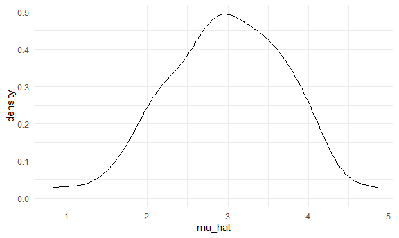

Simulation
================
Jessica Flynn
11/10/2020

``` r
library(tidyverse)
```

    ## -- Attaching packages --------------------------------------- tidyverse 1.3.0 --

    ## v ggplot2 3.3.2     v purrr   0.3.4
    ## v tibble  3.0.3     v dplyr   1.0.2
    ## v tidyr   1.1.2     v stringr 1.4.0
    ## v readr   1.3.1     v forcats 0.5.0

    ## -- Conflicts ------------------------------------------ tidyverse_conflicts() --
    ## x dplyr::filter() masks stats::filter()
    ## x dplyr::lag()    masks stats::lag()

``` r
library(rvest)
```

    ## Loading required package: xml2

    ## 
    ## Attaching package: 'rvest'

    ## The following object is masked from 'package:purrr':
    ## 
    ##     pluck

    ## The following object is masked from 'package:readr':
    ## 
    ##     guess_encoding

``` r
set.seed(1)

theme_set(theme_minimal() + theme(legend.position = "bottom"))

options(
  ggplot2.continuous.colour = "viridis",
  ggplot2.continuous.fill = "viridis"
)

scale_colour_discrete = scale_colour_viridis_d
scale_fill_discrete = scale_fill_viridis_d

knitr::opts_chunk$set(
  fig.width = 6,
  fig.asp = .6,
  out.width = "90%"
)
```

## Let’s simulate something

I have a function

``` r
sim_mean_sd = function(n, mu = 3, sigma = 4) {
  
  sim_data = 
    tibble(
    x = rnorm(n, mean = mu, sd = sigma),
  )
  
  sim_data %>% 
    summarize(
      mu_hat = mean(x),
      sigma_hat = sd(x)
    )
}
```

I can “simulate” by running this line

``` r
sim_mean_sd(30)
```

    ## # A tibble: 1 x 2
    ##   mu_hat sigma_hat
    ##    <dbl>     <dbl>
    ## 1   3.33      3.70

## Let’s simulate a lot

Let’s start with a for loop

``` r
output = vector("list")

for (i in 1:100) {
  
  output[[i]] = sim_mean_sd(30)
}

sim_results = bind_rows(output)
```

Let’s use a loop function

``` r
sim_results = 
  rerun(100, sim_mean_sd(30)) %>% 
  bind_rows()
```

Let’s look at results

``` r
sim_results %>% 
  ggplot(aes(x = mu_hat)) + 
  geom_density()
```



``` r
sim_results %>% 
  summarize(
    avg_samp_mean = mean(mu_hat), 
    sd_samp_mean = sd(mu_hat)
  )
```

    ## # A tibble: 1 x 2
    ##   avg_samp_mean sd_samp_mean
    ##           <dbl>        <dbl>
    ## 1          2.98        0.756

## Let’s try other sample sizes

``` r
n_list = 
  list(
    "n_30"  = 30, 
    "n_60"  = 60, 
    "n_120" = 120, 
    "n_240" = 240)

output = vector("list", length = 4)

for (i in 1:4) {
  output[[i]] = rerun(100, sim_mean_sd(n_list[[i]])) %>% 
    bind_rows
}
```

``` r
sim_results = 
  tibble(
    sample_size = c(30,60,120,240)
    ) %>% 
  mutate(
    output_list = map(.x = sample_size, ~rerun(1000,sim_mean_sd(n = .x))), 
    estimate_dfs = map(output_list, bind_rows)
    ) %>% 
  select(-output_list) %>% 
  unnest(estimate_dfs)
```

Do some data frame things

``` r
sim_results %>% 
  mutate(
    sample_size = str_c("n = ", sample_size),
    sample_size = fct_inorder(sample_size)) %>% 
  ggplot(aes(x = sample_size, y = mu_hat, fill = sample_size)) + 
  geom_violin()
```


``` r
sim_results %>% 
  group_by(sample_size) %>%
  summarize(
    avg_samp_mean = mean(mu_hat), 
    sd_samp_mean = sd(mu_hat)
  )
```

    ## `summarise()` ungrouping output (override with `.groups` argument)

    ## # A tibble: 4 x 3
    ##   sample_size avg_samp_mean sd_samp_mean
    ##         <dbl>         <dbl>        <dbl>
    ## 1          30          2.99        0.720
    ## 2          60          3.02        0.514
    ## 3         120          2.99        0.374
    ## 4         240          3.00        0.263
